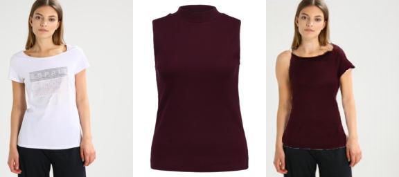
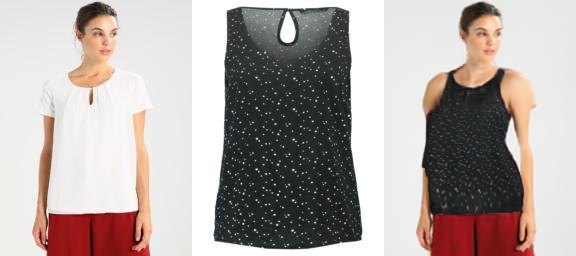
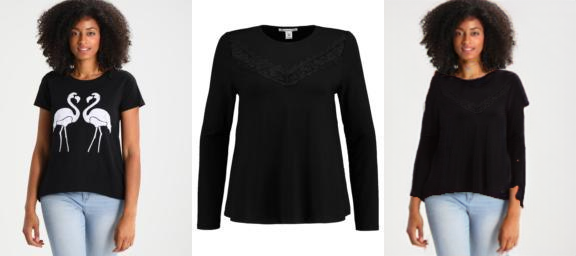
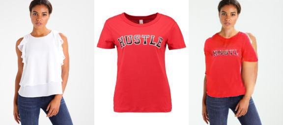

## Model Implementation
1. Download the working_viton.ipynb file: You need to obtain the Jupyter Notebook file named "working_viton.ipynb". This file likely contains code for a specific task or project related to the Viton dataset or a similar topic.

2. Run the commands sequentially: Import the notebook into Google Colab, a cloud-based platform for running Jupyter Notebooks. Once imported, go through the notebook and execute each code cell in sequence by clicking on the "Play2" button or pressing Shift+Enter.

3. Connect to Google Drive: At some point in the notebook, there might be code to connect to Google Drive. Follow the instructions provided in the notebook to access the provided Google Drive link, download the required files, and upload them to your Google Drive account.

4. Access files from Google Drive: After uploading the files to your Google Drive, update the file paths in the notebook to point to the correct location in your Drive.

5. Upload two images: Look for the code in the notebook where it requires uploading two images: one labeled as "000001_0" representing a person image, and the other labeled as "000001_1" representing a cloth image. Follow the instructions to upload these images to the notebook environment.

6. Handle file format error: There might be an error related to file formats, where you need to change the format from JPEG to PNG. Follow the instructions provided in the notebook to make this change.

7. Check the output: After resolving any errors and making necessary changes, run the code again and check the output. Ensure that the desired results are obtained and that the task or project is progressing as expected.

## ModelExplaination
ACGPN, which stands for Adaptive Content Generating and Preserving Network, is a deep learning model designed for virtual try-on applications. It's essentially a type of artificial intelligence (AI) that allows you to see how clothes would look on you in a photo  using image processing techniques.

Here's a breakdown of how it works:

Understanding the Image: ACGPN takes three inputs:

The image of the clothing you want to try on.
A "pose map" that outlines the position of your body parts in the photo you'll be virtually trying the clothes on.
A mask that segments different body parts in the photo (like arms, legs, torso).
Predicting the Look:  The model uses these inputs to predict how the clothes would look on you. It essentially creates a blueprint (semantic layout) of what the final image should look like.

Warping the Clothes:  ACGPN then takes the clothing image and warps it (adjusts its shape)  based on the predicted layout from step 2. To make this warping more realistic, the model uses a special technique to ensure a smooth transformation.

Putting it all Together:  Finally, ACGPN combines the warped clothes image with your original photo, filling in any missing parts or gaps using a process called inpainting. This creates the final image of you virtually wearing the clothes.

## Dataset
**VITON Dataset** This dataset is presented in [VITON](https://github.com/xthan/VITON), containing 19,000 image pairs, each of which includes a front-view woman image and a top clothing image. After removing the invalid image pairs, it yields 16,253 pairs, further splitting into a training set of 14,221 paris and a testing set of 2,032 pairs.

## Google Drive Link
This is the google drive link which has files to run the model. [GoogleDrive](https://drive.google.com/drive/folders/1DnAAE3xFyMa76pYzhIXZOBJy_sx4SiJL?usp=drive_link) 

## Example outputs

